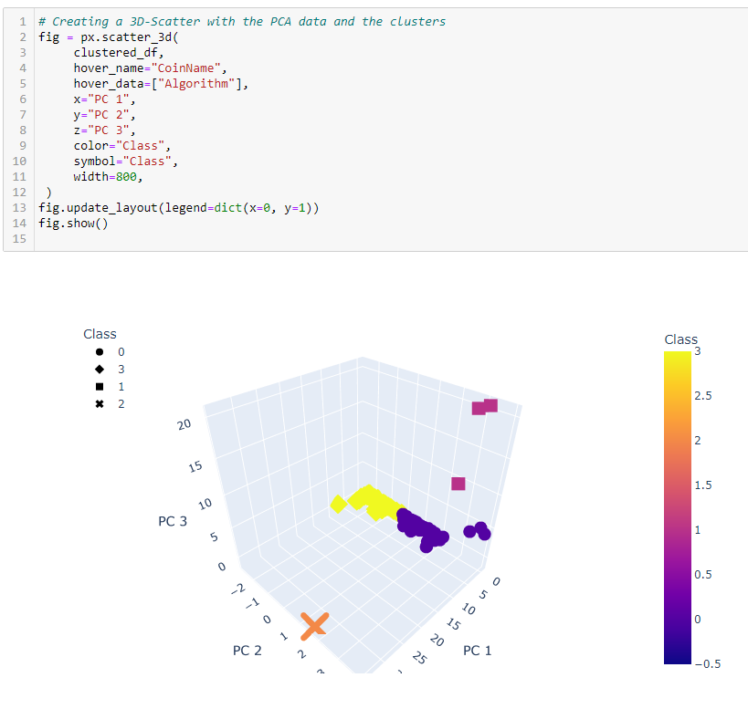
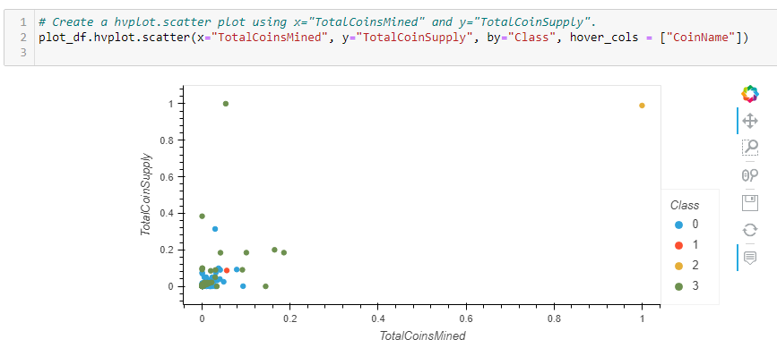

# Cryptocurrencies

## Project Purpose
The purpose of this project was to use unsupervised machine learning K-Means model on a cryptocurrency dataset to cluster the different coins for investment purposes. The data was processed, its dimensions were reduced, as well as its principal components using PCA.

## Project Results
### Loading of initital dataset

### Applying PCA to the components

### Getting the elbow curve

### Applying K-Means Model on Clustered Dataframe

### Creating the 3D Scatter Plot

### Creating the HV Scatter Plot

